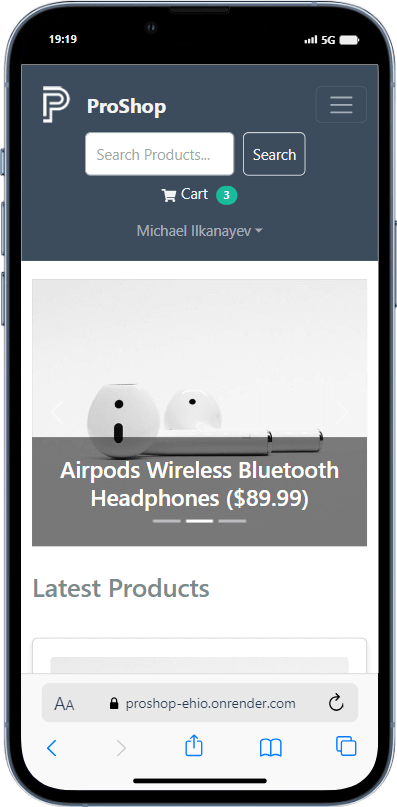
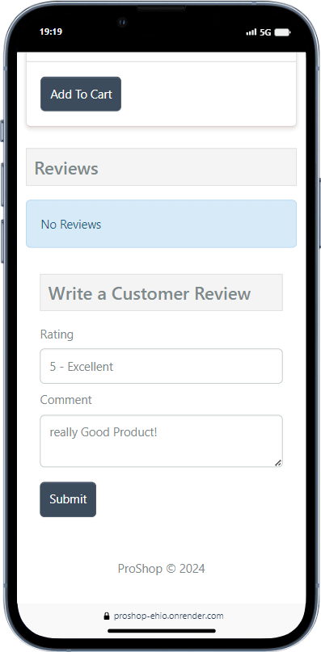
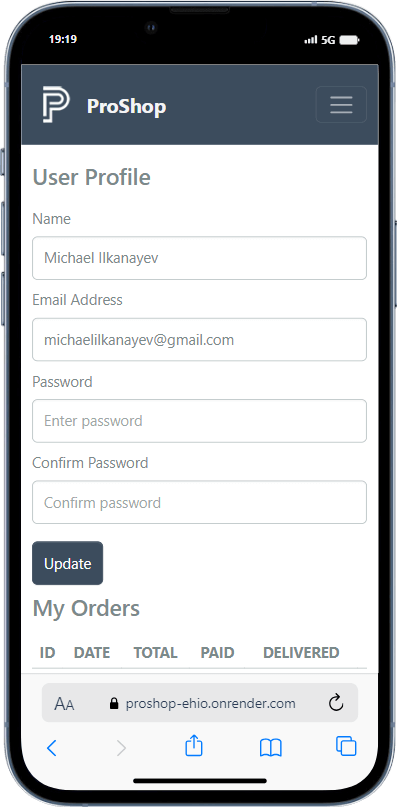

  
# ProShop

eCommerce platform built with the MERN (MongoDB, Express, React, Node.js) stack & Redux.

## Pictures:

### `Web:`

### `Mobile:`

  
  
  
  

 

## Demo:

Check out the live demo [here](https://proshop-ehio.onrender.com/).

## Features:

- Full featured shopping cart
- Product reviews and ratings
- Top products carousel
- Product pagination
- Product search feature
- User profile with orders
- Admin product management
- Admin user management
- Admin Order details page
- Mark orders as delivered option
- Checkout process (shipping, payment method, etc)
- PayPal / credit card integration
- Database seeder (products & users)

